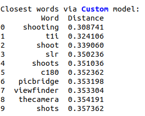
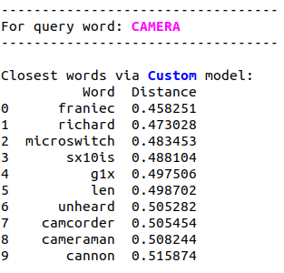

# Learning Vector Embeddings for Words

### ***Mallika Subramanian***  
### ***2018101041***

 

This report describes the methods adopted to train the word embeddings on the *Stanford Amazon Electronics Product Reviews* corpus using SVD decomposition of co-occurrence matrix and Continuous Bag of Words.

## Analysis for CBOW & SVD:

The dimensionality of each word vector is chosen as **50** (50 principle components/singular vectors) and a window size of **5 words** (left and right of the center word) is selected.

A very high dimension of the word vectors can cause unwanted effects since increasing the dimension to an extremely high value may not penalize the less frequent words, and hence typos or missing punctuation words which occur in the same context as a query word may become closer (which is not desired).

For SVD, a sparse matrix of the co-occurence matrix was constructed so as to fit the entire matrix into memory and since many of the entries in the VxV co-occ matrix would be 0.

### Closest words for the word "Camera":
| SVD | CBOW | GENSIM | 
:-------------------------:|:-------------------------:|:-------------------------:
  |   | 

***Observations:***

*  The **custom** model has words such as *photos*, *shoots*, *dslr*, etc. which are semantically very close to the query word "camera".

*  Some exceptions are *opportunities* with the lowest distance, indicating that this word occurs several times in similar contexts as the word "camera", and the word *camer* which is a typographical mistake that the model has learnt as well.

* On comparing the word embeddings from SVD and CBOW with Gensim, firstly it can be observed that the vocabulary in gensim based word embeddings is richer - this is because it is trained on a much larger corpus as compared to ~64K words in the custom models. Further, there are no typos in the gensim words. Lastly, due to a larger number of vectors in the Gensim vector space, it can be seen that the distances between the top words is also larger as compared to the custom model. 

***Inferences from results via the encoder decoder architechture***

On training the CBOW model using the enc-dec architechture of 2 Weight matrices, without an `nn.Embedding` layer, there are two weight matrices (W1 and W2) that are learnt by the model. W1 represents the *input word* representation while W2 represents the *output word* representation. The output word representation produces much better semantically closer embeddings since the input word rep captures more of contextual information than direct meaning representation.

Word that are extremely similar in terms of meaning to "camera" such as "camcorder", "cannon" etc. appear in the output rep, and as observed, apart from a few meaning similar words, many possible neighbouring words such as "enjoy", "very" occur in the input rep.

| Input Word Representation | Output Word Representation |
:-------------------------:|:-------------------------:
  |  

## Similar words to a mix of words:

The top most similar (geometrically closest) words for 5 words - adjectives, nouns, verbs combined - are shown below:

***Word : Bought, POS: Verb***

| SVD | CBOW | GENSIM |
:-------------------------:|:-------------------------:|:-------------------------:
  |    |  
  |    |  

***Word : Broken, POS: Adjective***

| SVD | CBOW | GENSIM |
:-------------------------:|:-------------------------:|:-------------------------:
  |    |  
  |    |  

***Word : Computer, POS: Noun***

| SVD | CBOW | GENSIM |
:-------------------------:|:-------------------------:|:-------------------------:
  |    |  
  |    |  

***Word : Excellent, POS: Adjective***

| SVD | CBOW | GENSIM |
:-------------------------:|:-------------------------:|:-------------------------:
  |    |  
  |    |  

***Word : iPhone, POS: Noun***

| SVD | CBOW | GENSIM |
:-------------------------:|:-------------------------:|:-------------------------:
  |    |  
  |    |  

***Word : Terrible, POS: Adjective***

| SVD | CBOW | GENSIM |
:-------------------------:|:-------------------------:|:-------------------------:
  |    |  
  |    |  

## Combined plot of the 6 words:
| SVD | CBOW |
:-------------------------:|:-------------------------:
 | 

The TSNE parameters can be fine-tuned further, so as to get perfect clusters of words. The current parameters do not preserve the geometric information of the 50 or 100 dimension vector space perfectly, and some representational info is lost while reducing dimensionality.

## Loss Plot for CBOW Training. 

The loss plot for CBOW training is shown below. The ***nn.Embedding*** based method uses 1M reviews to train, while the ***enc-dec*** based method uses 20K reviews. 

The loss decreases from ~8-9 to roughly ~4-5 and can be further decreased if trained on a larger corpus and for more number of epochs. 

## Computational constraints:

* ***Building vocabulary from 1M reviews (instead of 1.6M)***: To construct the entire vocabulary, it takes around 20 hours or so. Further, requesting for a higher memory and cpu configuration causes a SLURM error on ADA:

* ***Training CBOW enc-dec on a smaller sample***: Since the compute time to train 1 epoch of enc-dec CBOW on the entire corpus of 1.6M reviews was nearly 14 hours, to train 20 epochs would take 280 hours which is > 10 days. 10 epochs also would take 140 hours which is ~5 days. Hence the enc-dec CBOW architechture was trained on a smaller subset of 20K reviews. The screenshot of runtime is :

